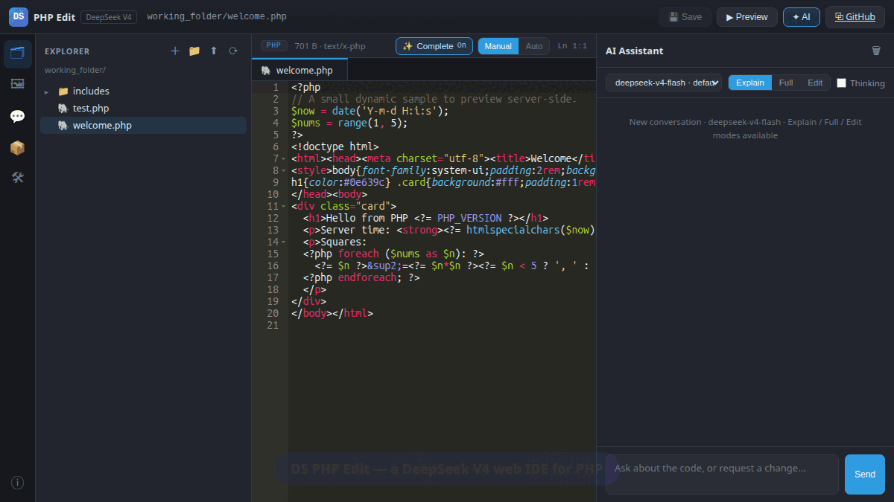
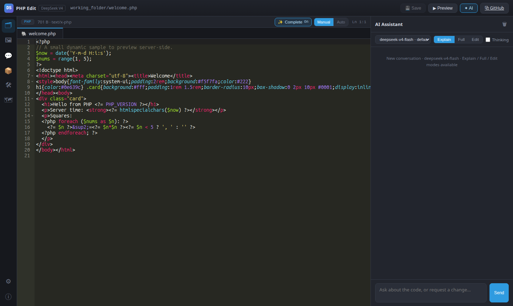
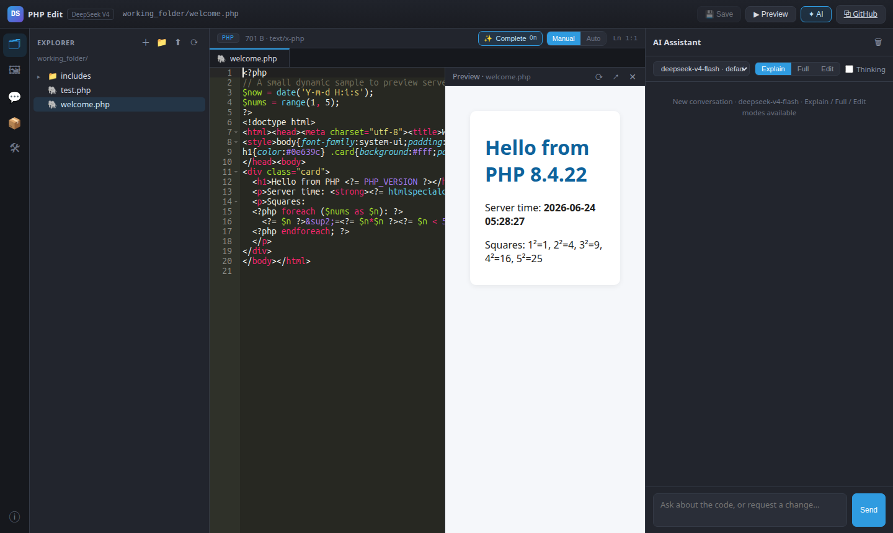
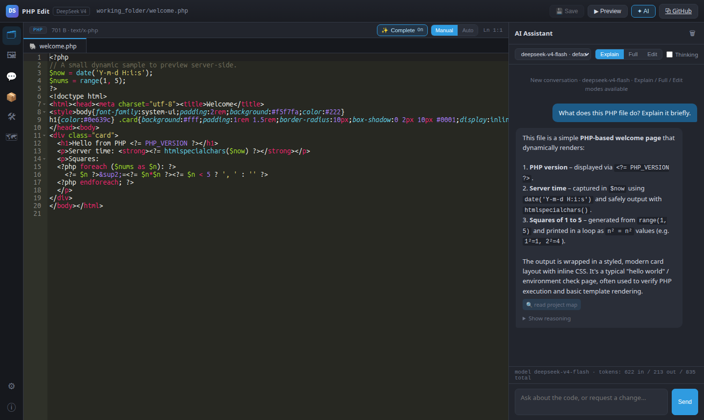
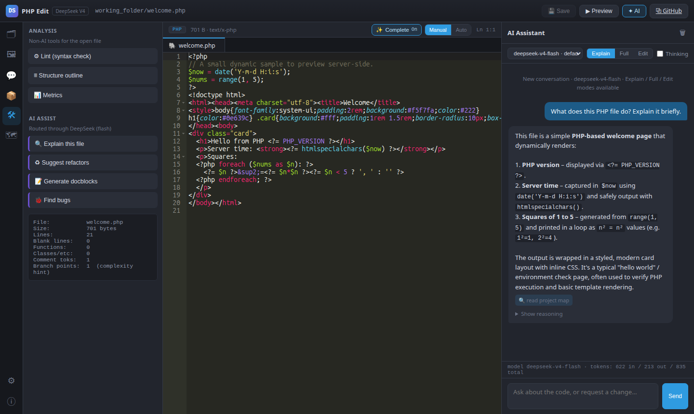
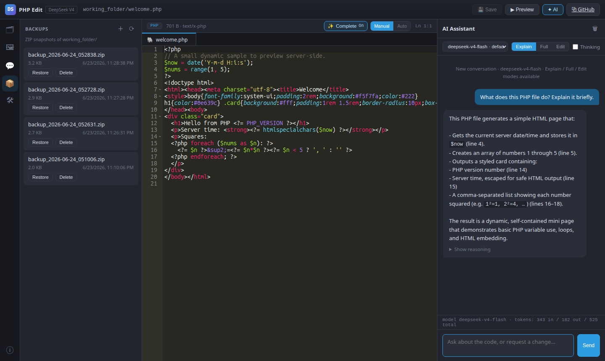
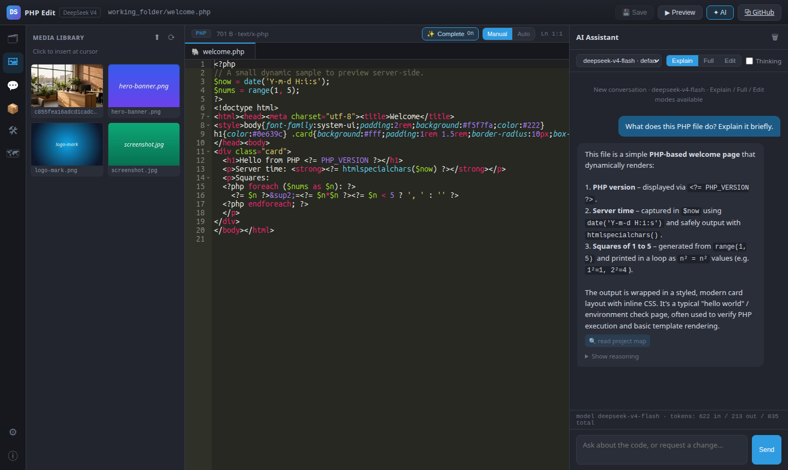

<div align="center">

# 🛠️ DS PHP Edit

### A self-hosted, **DeepSeek V4–powered web IDE** for editing and **live-previewing PHP** — right in your browser.

Drop a PHP project into `working_folder/`, edit it with full syntax highlighting,
ask the AI to explain / rewrite / surgically patch your code, then hit **▶ Preview**
to run the PHP **server-side** and see the real, rendered result.

[](LICENSE)
[](https://www.php.net/)
[](https://ace.c9.io/)
[](https://api.deepseek.com/)
[](#-no-cdn-everything-is-vendored)

**Author:** [g023](https://github.com/g023/) · **Editor:** Ace (BSD-3, vendored) · **No CDN — every asset is local.**



</div>

---

## 🚨 READ THIS FIRST — Do **NOT** put this on a public server

> ## ⛔ This tool runs arbitrary PHP. It is **NOT** for a publicly accessible folder.
>
> The entire point of **Preview** is to **execute user-supplied PHP through the web server** — that is **remote code execution by design**, and **no PHP setting makes it safe against a stranger.** Anyone who can reach this app can run any code on your machine.
>
> ### The one supported posture:
> ### 👉 **Single trusted operator, bound to `127.0.0.1` (localhost).**
>
> **Never** expose DS PHP Edit on a shared host, a VPS with a public port, a `0.0.0.0` bind, or any internet-reachable directory. Every other security control in this app (CSP, CSRF, path sandboxing, upload hardening) is **defense-in-depth on top of network isolation — never a substitute for it.**

See [`SECURITY.md`](SECURITY.md) for the full threat model. **If in doubt, keep it on your laptop.**

---

## ✨ The whole loop in one sentence

> **Drop a PHP project in → open a file → edit it → ask the AI → ▶ Preview → repeat.**

| | |
|---|---|
| ✏️ **Edit** real PHP with highlighting, line numbers & AI autocomplete | 🤖 **Ask** DeepSeek to explain, rewrite, or patch your code |
| ▶️ **Preview** runs your PHP *server-side* — real output, not a static playground | 📦 **One-click ZIP** backups & safe restore |
| 🖼️ **Media library** with auto-thumbnails & snippet insertion | 🔒 **100% local** — no CDN, no telemetry, no build step |

---

## 📸 Screenshots

<table>
  <tr>
    <td width="50%"><br><b>Editor</b> — Ace highlighting, line numbers, file tree, tabs</td>
    <td width="50%"><br><b>Live preview</b> — your PHP executed for real, server-side</td>
  </tr>
  <tr>
    <td><br><b>AI assistant</b> — Explain / Full rewrite / Edit (search-replace)</td>
    <td><br><b>Analysis</b> — in-process syntax-check lint (no <code>php -l</code> subprocess), structure outline, metrics</td>
  </tr>
  <tr>
    <td><br><b>Backups</b> — one-click ZIP, Zip-Slip-safe restore</td>
    <td><br><b>Media library</b> — upload, thumbnail, insert at cursor</td>
  </tr>
</table>

> 🎥 A full walkthrough video is in [`screenshot_vids/`](screenshot_vids/) (`ds-php-edit-demo.mp4` / `.gif`).

---

## 🚀 Quick start (zero-install, drop-in)

There is **no build step, no installer, no package manager, no setup wizard.** Getting the folder onto a PHP host and opening it is the *entire* deployment.

### 1. Get the code

```bash
git clone https://github.com/g023/dsphpedit.git
cd dsphpedit
```

### 2. Add your DeepSeek API key

Copy the example key file and paste your `sk-...` key into it (one line):

```bash
cp K.dat.example K.dat
# then edit K.dat and replace the placeholder with your real DeepSeek key
```

> 🔑 Get a key at <https://platform.deepseek.com/>. The key stays **server-side only** — it never reaches the browser. Editing and preview work **without** a key; only the AI features need it.

### 3. Run it (localhost only)

**Option A — built-in PHP server (recommended, easiest localhost binding):**

```bash
php -S 127.0.0.1:8000 router.php
# open http://127.0.0.1:8000/
```

The `router.php` front controller blocks direct HTTP access to secrets/state (`K.dat`, history JSON, backups, dotfiles) and serves vendored assets directly.

**Option B — Apache (userdir / vhost / subfolder):**

Place the folder under a served path, e.g. `~/public_html/dsphpedit/`, and open
`http://localhost/~youruser/dsphpedit/`. The bundled `.htaccess` denies `K.dat`
and dotfiles; `working_folder/uploads/.htaccess` makes the upload dir
non-executable. The app is **path-independent** — every server path derives from
`__DIR__` and every front-end URL is relative, so it works at any path or location.

> 🔒 **To hard-enforce localhost at the Apache layer:** uncomment the
> `Require ip 127.0.0.1` block in `.htaccess`, or bind Apache's `Listen` to `127.0.0.1`.

### 4. That's it

Required runtime directories (`working_folder/uploads/`, `working_folder/g023_backups/`, `working_folder/g023_history.json`, thumbnails) are **auto-created on first use** — delete them and they come back. A small sample project (`welcome.php`) is already in `working_folder/` so you have something to preview immediately.

---

## ✅ Requirements

- **PHP 8.1+** (developed against 8.4). A CLI `php` binary must be available (used for preview + lint).
- PHP extensions — **all stock, no PECL/compile:**
  **`curl`** (DeepSeek), **`gd`** (thumbnails), **`zip`** (backups),
  **`fileinfo`** (upload MIME), **`mbstring`**, plus `json` / `session`.

Verify your host before you start:

```bash
php tools/selfcheck.php       # checks extensions, writable dirs, key, preview capability
php tools/test_paths.php      # path-traversal test suite — must be ALL GREEN
```

Both also render in a browser (they are localhost-only tools).

> ⚠️ The `working_folder/` must be **writable by the web-server user** (e.g. `www-data`
> under Apache). If saves, uploads, or backups fail with "Write failed," fix the
> directory permissions.

---

## 🧩 Features

| Area | What you get |
|---|---|
| **Editor** | Ace with syntax highlighting + line numbers for PHP / HTML / JS / CSS / JSON / Markdown, language auto-selected by extension, `Ctrl+S` to save, dirty-state tracking, multi-file tabs with persisted UI state. |
| **AI code completion** | Copilot-style inline **ghost-text** suggestions from DeepSeek (flash, fill-in-the-middle using code before *and* after the cursor). Suggestions are **overlap-deduped** so they splice in cleanly — any head that re-types the code before the cursor (e.g. a doubled `//`) or tail that re-types the code after it (doubled `)`, `;`, `}`, or whole lines) is trimmed server-side. Toggle on/off (`Alt+Shift+A` or the **✨ Complete** control); choose **Manual** (suggest on `Alt+\`) or **Auto** (suggest as you pause). Accept all with **✓ Accept**, one word with **✓ word** / `Alt+]`, dismiss with `Esc`. `Tab` keeps normal indent. Persists per browser. |
| **File explorer** | Tree scoped to `working_folder/`; create / rename / delete files & folders; nested dirs; right-click actions. App-managed state is hidden from the picker. |
| **Server-side preview** | Runs the saved PHP **natively through the web server** — exactly as it will in production (real `$_SERVER`, `header()`, sessions) — and renders output in a same-origin iframe. PHP errors / warnings / fatals are shown. Path-confined to `working_folder/`; works under Apache/mod_php, PHP-FPM, and `php -S`. |
| **AI assistant** | DeepSeek V4. Three modes: **Explain** (Q&A), **Full** (whole updated file → *Apply full code*), **Edit** (JSON search/replace → *Apply edits*). Optional **Thinking** mode surfaces reasoning. Token usage shown. |
| **Models** | `deepseek-v4-flash` is the default everywhere (~3× cheaper). `deepseek-v4-pro` is an opt-in selector, never the default. |
| **Media** | Upload images / PDF / audio / video. Server-side MIME allowlist (finfo), GD re-encode (strips payloads/EXIF), auto thumbnails, randomized filenames, **non-executable** upload dir. The media browser inserts the right snippet at the cursor. |
| **History** | Conversations persisted to `working_folder/g023_history.json` — browsable, reloadable, clearable, rotated. |
| **Backup / restore** | One-click ZIP of `working_folder/` (atomic). **Zip-Slip-safe** restore (per-entry validation, stream extraction, temp-dir-then-swap). Retention prunes oldest (default 20). |
| **Analysis tools** | Non-AI: in-process syntax-check lint (`token_get_all` full-parse — no `php -l`/CLI subprocess), structure outline, metrics. AI: explain / refactor / docblocks / find-bugs (routed through DeepSeek on flash). |
| **Security** | Strict `'self'` CSP, CSRF on every state-changing POST, hardened sessions, security headers, single `safe_resolve()` path gate, key never reaches the browser. |

---

## 🗂️ Architecture

```
dsphpedit/
├── index.php          Front-end shell (CSP, CSRF meta, vendored asset includes)
├── config.php         Paths, model policy, limits, self-creating state
├── router.php         Front controller for `php -S` (denies secrets/state)
├── .htaccess          Apache hardening (denies K.dat, dotfiles; security headers)
├── K.dat              YOUR DeepSeek API key (git-ignored; never web-served)
├── K.dat.example      Placeholder you copy to K.dat
├── lib/
│   ├── ds4.php        Canonical DeepSeek connector (ds4_chat / llm_get)
│   ├── paths.php      safe_resolve() — the ONE gate for all file I/O
│   ├── security.php   session bootstrap, CSRF, security headers, api_guard()
│   └── response.php   JSON envelope helpers
├── api/
│   ├── files.php      list / read / write / create / rename / delete / mkdir
│   ├── preview.php    server-side PHP execution (the headline feature)
│   ├── ai_chat.php    explain / full / edit modes
│   ├── complete.php   AI inline code completion (fill-in-the-middle)
│   ├── upload.php     finfo + GD re-encode + thumbnail
│   ├── media.php      media browse + thumbnail/raw serving
│   ├── history.php    conversation history
│   └── backup.php     create / list / restore / delete (Zip-Slip-safe)
├── ai_tools/assist.php   programmatic AI tools (explain/refactor/docblocks/bugs)
├── tools/
│   ├── analyze.php    non-AI lint / outline / metrics
│   ├── selfcheck.php  environment self-check
│   └── test_paths.php traversal test suite
├── assets/vendor/     Ace (BSD-3) + jQuery — all local, no CDN
├── docs/PRD.md        product requirements / spec of record
└── working_folder/    YOUR project under edit (the sandbox boundary)
    ├── welcome.php     sample file (preview this first)
    ├── uploads/        media (non-executable, .htaccess)
    ├── g023_backups/   ZIP snapshots (auto-created)
    └── g023_history.json  conversation history (auto-created)
```

**Boundary rule:** every file read / write / upload / preview passes through
`safe_resolve()`, confining it to `working_folder/`.

---

## 🔌 DeepSeek integration notes

- Endpoint: `https://api.deepseek.com/chat/completions` (OpenAI-compatible). Bearer auth; key trimmed.
- The connector returns `['reasoning', 'response', 'meta' => [id, model, finish_reason, usage, tool_calls?]]`.
- `reasoning` comes from `message.reasoning_content` (populated only when **Thinking** is enabled via `thinking: {type: enabled}`).
- Default model **`deepseek-v4-flash`**; `deepseek-v4-pro` is opt-in. Legacy `deepseek-chat` / `deepseek-reasoner` are **not** targeted.
- **Code completion sends `thinking: {type: disabled}`.** flash reasons by default even when the param is omitted, and that reasoning adds latency *and* is counted against `max_tokens` — often consuming the whole budget and returning an empty completion (`finish_reason=length`). Disabling thinking makes completions fast (~1s) and non-truncated. (The chat assistant leaves Thinking user-controllable.)
- **Code completion is FIM-with-dedup.** The prompt sends up to 6000 chars of prefix and 4000 chars of suffix, instructing the model that the code after the cursor *already exists* and must not be rewritten. Because chat models still re-emit closers and restate just-typed tokens, the server trims the completion against the real prefix (`dspe_trim_prefix_overlap`) and the **full** untruncated suffix (`dspe_trim_suffix_overlap`) before returning it — single-char overlaps are only trimmed when structural (punctuation / closers / whitespace) to avoid eating a coincidental identifier letter.

---

## 🧱 No CDN — everything is vendored

Every third-party asset (the Ace editor and jQuery) is **downloaded into
`assets/vendor/`** and served locally. There are **no external script tags, no
CDN calls, and no telemetry.** Combined with the strict `'self'` CSP, the browser
talks only to your own server. Third-party licenses are reproduced in
[`LICENSE`](LICENSE) and alongside the vendored code.

---

## 🩺 Troubleshooting

- **AI says "no K.dat key":** copy `K.dat.example` → `K.dat` and paste your `sk-...` key. Editing/preview work without it.
- **Preview is blank / errors:** PHP fatals are shown in the preview pane; check the diagnostics banner. Preview runs with a 15s timeout and a memory cap.
- **"Write failed" on save/upload/backup:** make `working_folder/` writable by the web-server user.
- **Backups fail:** ensure the `zip` extension is loaded (`php tools/selfcheck.php`).

---

## 📄 License

MIT © [g023](https://github.com/g023/). See [`LICENSE`](LICENSE).
Bundles **Ace** (BSD-3-Clause) and **jQuery** (MIT), vendored under `assets/vendor/`.

---

<div align="center">

**Built for builders.** Drop a project in, edit, ask, preview. That's the whole loop.

⭐ If this is useful, star it on [GitHub](https://github.com/g023/dsphpedit).

</div>
